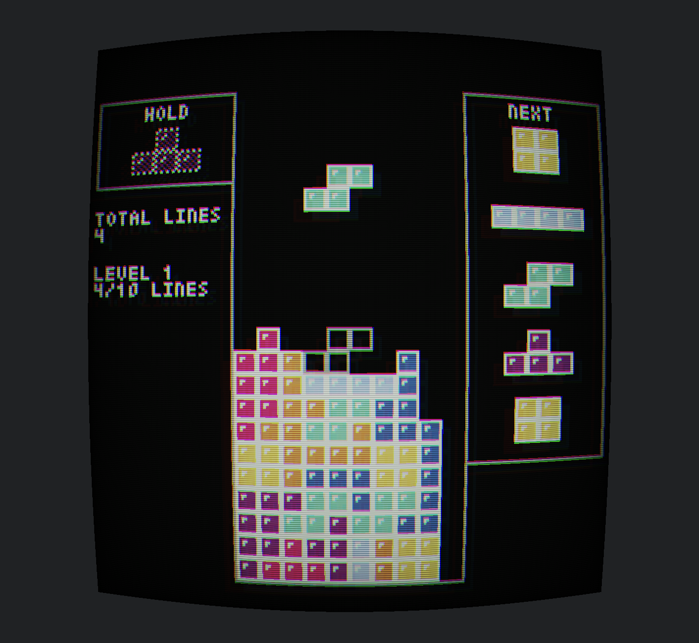

# ttris

A game created with pyxel that implements most of the modern Tetris Guideline
rules while keeping an old-school, simple, and retro vibe. Press `Alt(Opt) + 9`
to disable the retro screen warp effect.

## Controls

- **SPACE**: hard drop tetrimino
- **ARROW DOWN**: soft drop
- **ARROW LEFT**: move tetrimino left by one block
- **ARROW RIGHT**: move tetrimino right by one block
- **ARROW UP** & **X**: rotate tetrimino clockwise
- **Z**: rotate tetrimino counterclockwise
- **A**: flip tetrimino 180 degrees
- **SHIFT**: hold current tetrimino

## TODO

- [ ] Ability to restart the board for another run after game over screen
- [ ] Keeping score of current board state (accounting for level )
- [ ] Ability to tweak DAS (delayed auto shift) and ARR (automatic repeat rate)
      settings in a game menu
- [ ] Adjustable line clear delay (currently none)
- [ ] Fancier (particle) effects when clearing lines or performing t-spins
- [ ] Offline (Online?) Leaderboard
